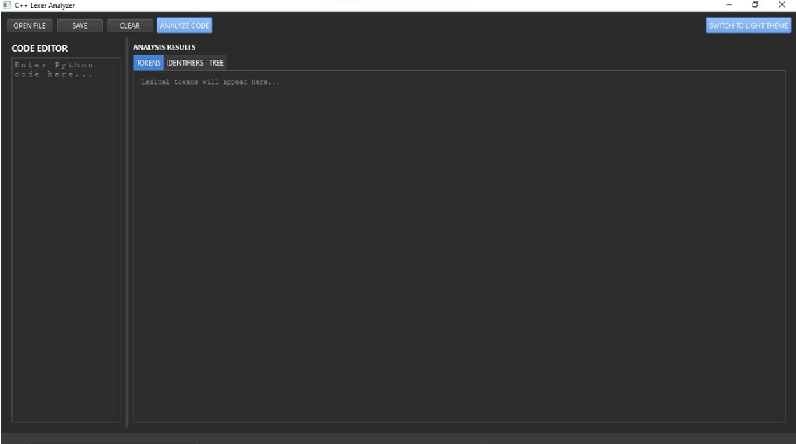
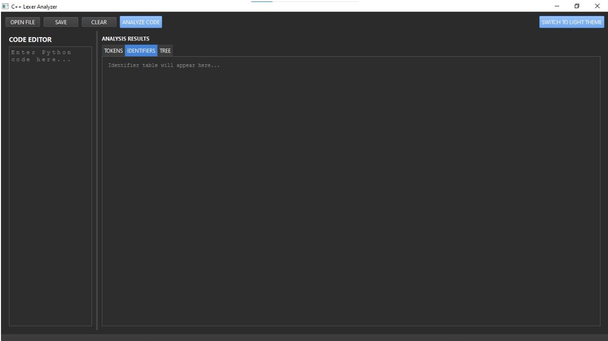
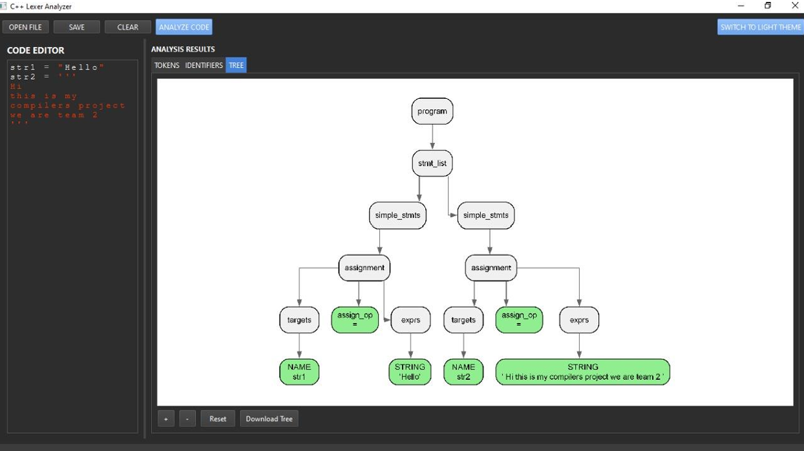
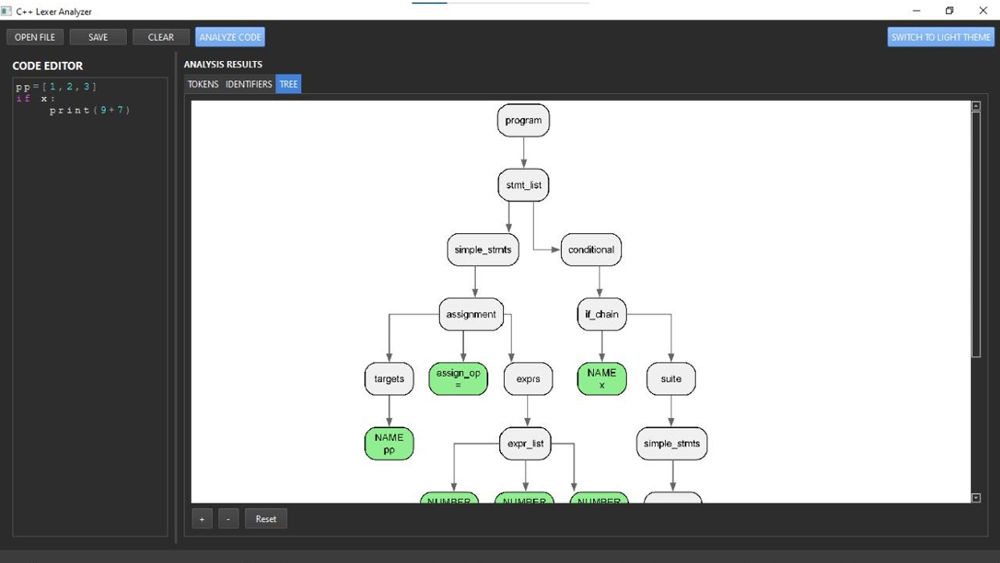
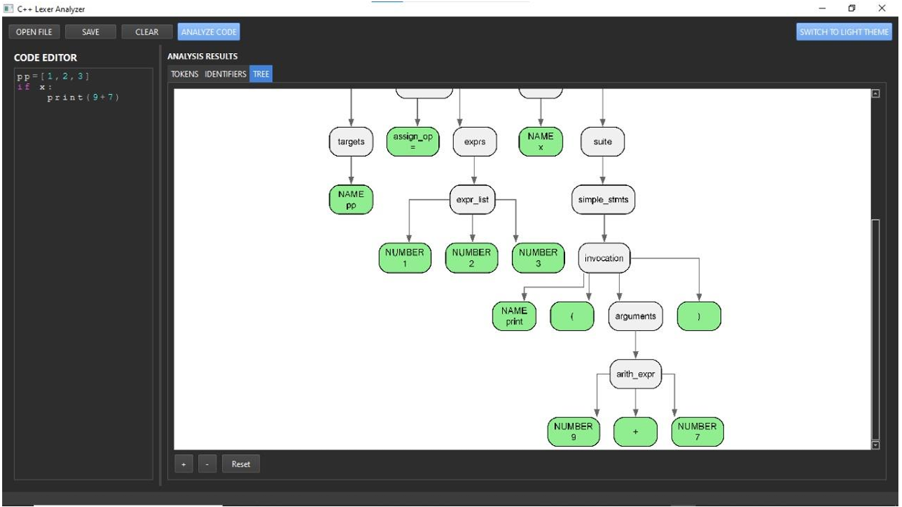
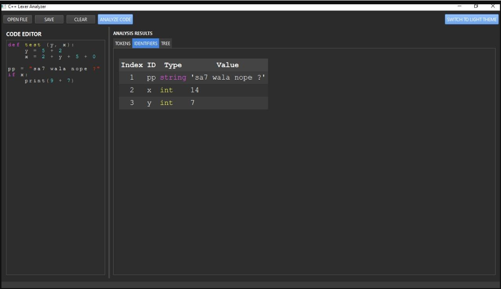
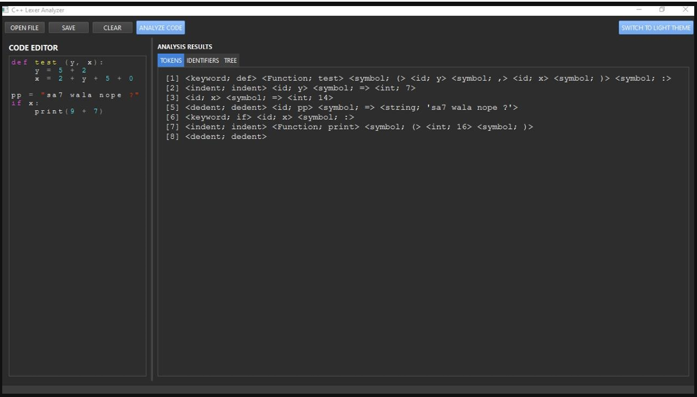
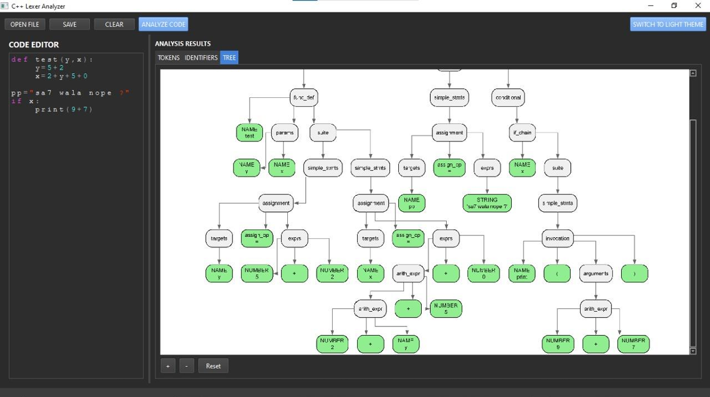
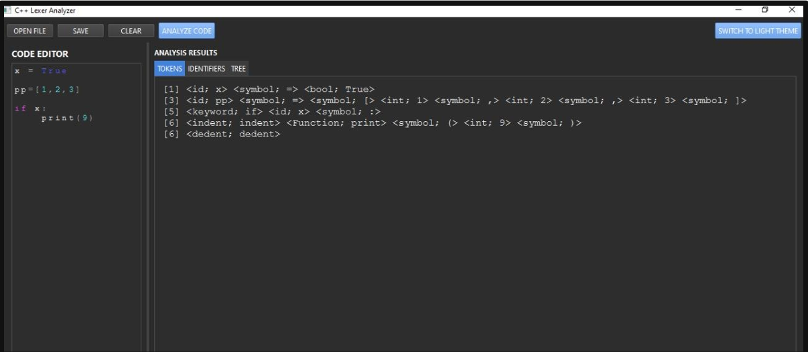
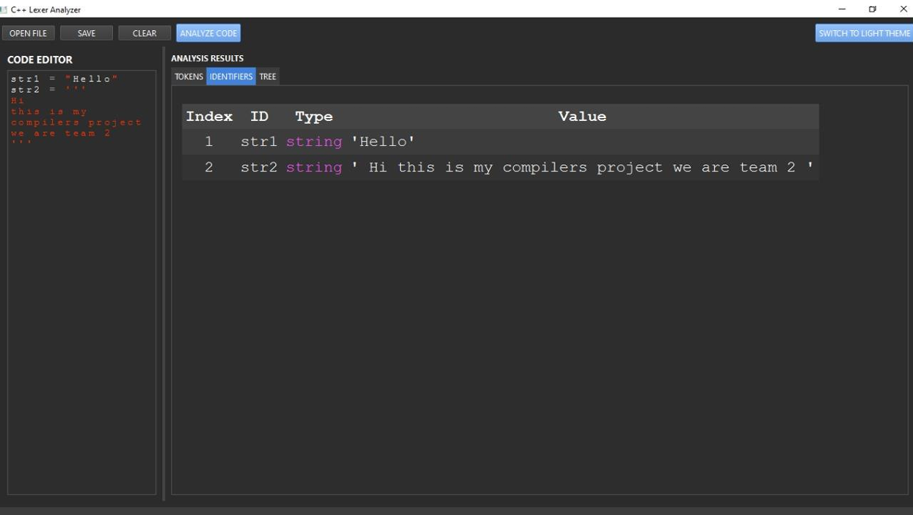

# Python Compiler Project

A comprehensive Python lexical analyzer and parser implementation with both terminal-based and GUI interfaces. This project demonstrates the fundamental phases of compiler construction: lexical analysis (tokenization) and syntax analysis (parsing).

## 🚀 Features

### Core Functionality
- **Lexical Analysis**: Complete tokenization of Python source code
- **Syntax Analysis**: Recursive descent parser with parse tree generation
- **Symbol Table**: Automatic symbol table construction and management
- **Error Handling**: Comprehensive error detection and reporting
- **Parse Tree Visualization**: DOT file generation and PNG image creation

### Supported Python Constructs
- **Data Types**: Integers, floats, strings, booleans, lists
- **Control Flow**: if/elif/else statements, while loops, for loops
- **Functions**: Function definitions with parameters and return statements
- **Classes**: Basic class definitions with inheritance
- **Operators**: Arithmetic, comparison, logical, and assignment operators
- **Comments**: Single-line (#) and multi-line (""" or ''') comments
- **Indentation**: Proper Python indentation handling with INDENT/DEDENT tokens

### Advanced Features
- **Multi-line String Handling**: Proper processing of triple-quoted strings
- **Bracket Matching**: Detection of mismatched parentheses, brackets, and braces
- **Expression Evaluation**: Basic arithmetic expression evaluation during tokenization
- **Function Call Detection**: Automatic identification of function calls vs identifiers

## 🖥️ Interface Options

### 1. Terminal Interface (`Main_Code_On_Terminal.cpp`)
- Command-line based execution
- Direct file processing
- Console output for tokens, parse tree, and symbol table
- Suitable for batch processing and automation

### 2. GUI Interface (`Main_GUI_Code.cpp`)
- Modern Qt-based graphical interface
- **Syntax Highlighting**: Real-time Python syntax highlighting with customizable themes
- **Tabbed Interface**: Separate tabs for source code, tokens, parse tree, and symbol table
- **Visual Parse Tree**: Interactive parse tree visualization with high-resolution PNG export
- **Theme Support**: Dark and light theme options
- **File Operations**: Load, save, and manage Python source files
- **Real-time Processing**: Instant feedback as you type or modify code

## 🛠️ Dependencies

### Terminal Version
- **C++17** compatible compiler (GCC, Clang, MSVC)
- **Standard Library**: iostream, fstream, regex, vector, map, stack
- **Graphviz** (optional, for parse tree visualization)

### GUI Version
- **Qt Framework** (Qt5 or Qt6)
- **C++17** compatible compiler
- **Graphviz** (for parse tree image generation)
- **Windows API** (for directory creation on Windows)

## 🔧 Compilation

### Terminal Version
```bash
g++ -std=c++17 src/Main_Code_On_Terminal.cpp -o python_compiler
```

### GUI Version
```bash
# Using qmake
qmake
make

# Or using CMake
mkdir build && cd build
cmake ..
make
```

## 🚀 Usage

### Terminal Version
1. Place your Python source code in a file named `test.py`
2. Run the compiler:
   ```bash
   ./python_compiler
   ```
3. Output files generated:
   - `Tokens.txt`: Tokenized representation
   - `parse_tree.dot`: DOT file for parse tree
   - `parse_tree.png`: Visual parse tree (if Graphviz installed)

### GUI Version
1. Launch the application
2. Load a Python file or type code directly
3. View results in different tabs:
   - **Source**: Edit Python code with syntax highlighting
   - **Tokens**: View tokenization results
   - **Parse Tree**: Interactive parse tree visualization
   - **Symbol Table**: Variable and function declarations

## 📊 Output Examples

### Token Output Format
```
Line 1 - Keyword: def
Line 1 - Identifier: factorial
Line 1 - Symbol (opening bracket): (
Line 1 - Identifier: n
Line 1 - Symbol (closing bracket): )
Line 1 - Symbol: :
```

### Parse Tree Structure
```
Program
└── FunctionDef: factorial
    ├── Parameters: n
    └── Body:
        └── IfStmt
            ├── Condition: n <= 1
            ├── Then: Return(1)
            └── Else: Return(n * factorial(n-1))
```

### Symbol Table
```
Index  |  ID      | Type    | Value
-------------------------------------
     0 | factorial| N/A     | N/A
     1 | n        | N/A     | N/A
     2 | result   | int     | 120
```

## 🎯 Key Components

### Lexical Analyzer
- **Token Recognition**: Identifies keywords, identifiers, numbers, strings, symbols
- **Error Detection**: Invalid identifiers, unterminated strings, indentation errors
- **Multi-line Support**: Handles triple-quoted strings and line continuations
- **Bracket Tracking**: Maintains stack-based bracket matching

### Parser
- **Recursive Descent**: Clean, maintainable parsing approach
- **Grammar Support**: Comprehensive Python grammar subset
- **Error Recovery**: Continues parsing after errors when possible
- **AST Generation**: Creates detailed abstract syntax trees

### Symbol Table
- **Automatic Construction**: Built during parsing phase
- **Type Inference**: Determines variable types from assignments
- **Scope Tracking**: Handles function and class scopes
- **Value Tracking**: Stores constant values where applicable

## 🎨 GUI Features

### Syntax Highlighting
- **Keyword Highlighting**: Different colors for various keyword types
- **Function Detection**: Automatic highlighting of function names
- **String/Number Highlighting**: Distinct colors for literals
- **Comment Styling**: Proper comment formatting
- **Theme Support**: Dark and light themes

### Parse Tree Visualization
- **Interactive Display**: Zoom and pan capabilities
- **High-Resolution Export**: 300 DPI PNG generation
- **Node Styling**: Different styles for leaf and internal nodes
- **Hierarchical Layout**: Clear parent-child relationships

## 🔍 Error Handling

### Lexical Errors
- Invalid identifiers (starting with numbers)
- Unterminated strings
- Indentation errors (non-multiple of 4 spaces)
- Mismatched brackets

### Syntax Errors
- Missing colons after control structures
- Invalid expression syntax
- Unexpected tokens
- Incomplete statements

## 📸 Media





















## 🎓 Educational Value

This project serves as an excellent educational tool for:
- **Compiler Construction**: Understanding lexical and syntax analysis
- **Language Processing**: Learning how programming languages are processed
- **Data Structures**: Practical application of stacks, trees, and hash tables
- **GUI Development**: Modern Qt application development
- **Software Engineering**: Large-scale C++ project organization

## 🔮 Future Enhancements

- **Semantic Analysis**: Type checking and scope resolution
- **Code Generation**: Intermediate code or bytecode generation
- **Optimization**: Basic code optimization techniques
- **Extended Grammar**: Support for more Python constructs
- **IDE Features**: Code completion, refactoring tools
- **Debugging Support**: Breakpoints and step-through debugging


*This project demonstrates the fundamental concepts of compiler construction through a practical implementation of a Python lexer and parser with modern GUI capabilities.*
